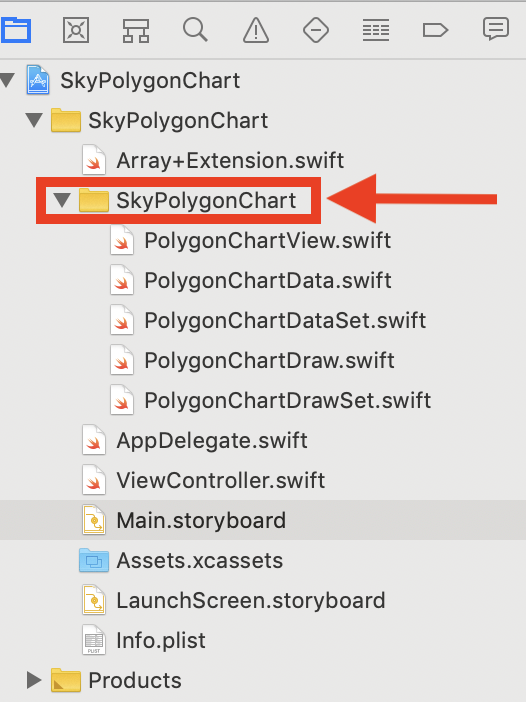
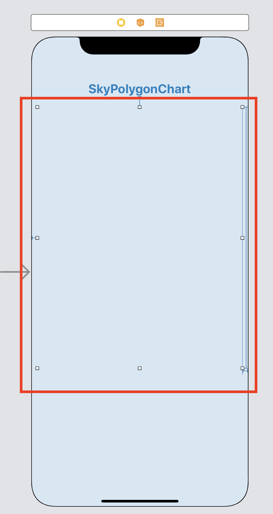
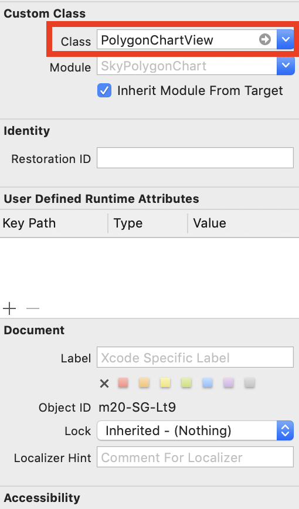

# SkyPolygonChart


### Manually

-------------

1\. Download and drop [SkyPolygonChart] folder in your project

2\. Configuration

Usage example
-------------

1\. Drop  [SkyPolygonChart] folder in your project



2\. Make UIView in StoryBoard



3\. Designate Custom Class ‘PolygonChartView’ in your polygonChartView



4\. Set configuration by code

- Set init

```swift
class ViewController: UIViewController {
    @IBOutlet weak var polygonChartWrapView: PolygonChartView!
    
    override func viewDidAppear(_ animated: Bool) {
        super.viewDidAppear(animated)
        self.initPolygonChartView()
    }
    
    func initPolygonChartView() {
        self.polygonChartWrapView.delegate = self
        self.polygonChartWrapView.backgroundColor = .clear
        self.polygonChartWrapView.start()
    }
}
```

- Extension PolygonChartViewDelegate
```swift
extension ViewController: PolygonChartViewDelegate {
    func setPolygonChartDrawSets(polygonChart: PolygonChartView, radius: CGFloat) -> PolygonChartDrawSet {
        // return PolygonChartDrawSet
    }
    
    func setPolygonChartDataSets(polygonChart: PolygonChartView) -> PolygonChartDataSet? {
        // return PolygonChartDataSet
    }
    
    func numberOfPolygonChart(polygonChart: PolygonChartView) -> Int {
        // return numberOfPolygon
    }
}
```

### Attribute

-------------

- PolygonChartDraw
```swift
var radius: CGFloat?

var fillColor       : CGColor       = UIColor.clear.cgColor
var strokeColor     : CGColor       = UIColor.clear.cgColor

var lineDashPattern : [NSNumber]?
var lineWidth       : CGFloat       = 0

var objectTextSet   : [String]?
var objectColor     : UIColor       = UIColor.black
var objectFont      : UIFont        = UIFont.systemFont(ofSize: 15, weight: .medium)

var unitText        : String?
var unitColor       : UIColor       = UIColor.black
var unitFont        : UIFont        = UIFont.systemFont(ofSize: 12, weight: .regular)

var isSkeleton      : Bool          = false
```

- PolygonChartData
```swift
var fillColor       : CGColor       = UIColor.clear.cgColor
var strokeColor     : CGColor       = UIColor.clear.cgColor

var lineDashPattern : [NSNumber]?
var lineWidth       : CGFloat       = 0
var isAnimate       : Bool          = false
var values          : [Double]?
```
